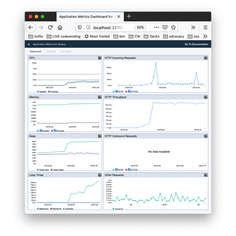

# Node Application Metrics Dashboard

[](https://travis-ci.org/RuntimeTools/appmetrics-dash)
[](https://codebeat.co/projects/github-com-runtimetools-appmetrics-dash-master)
[](https://codecov.io/github/RuntimeTools/appmetrics-dash?branch=master)

[](https://developer.ibm.com/node/monitoring-post-mortem/application-metrics-node-js/)
[](http://github.com/CloudNativeJS/ModuleLTS)
[](http://ibm.biz/node-support)

[Node Application Metrics Dashboard](https://developer.ibm.com/node/monitoring-post-mortem/application-metrics-node-js/) (appmetrics-dash) provides a very easy-to-use web based dashboard to show the performance metrics of your running Node.js application.



If you want to add the dashboard to all HTTP servers created by your application then simply add:

```js
// Before all other 'require' statements:
require('appmetrics-dash').attach();
```
to the very top of your main JavaScript source file.

Alternatively, to use preloading:

```sh
$ node --require appmetrics-dash/attach app.js
```

or use the NODE_OPTIONS environment variable:

```sh
$ export NODE_OPTIONS="--require appmetrics-dash/attach"
```

If you want to add the dashboard to one specific HTTP server then use:

```js
var dash = require('appmetrics-dash');
// Other 'require' statements here
// Create HTTP server 'myHttpServer' here
dash.monitor({server: myHttpServer});
```
If you are not creating an HTTP server then use:

```js
// Before all other 'require' statements:
require('appmetrics-dash').monitor();
```

or run your program with

```sh
$ node --require appmetrics-dash/monitor app.js
```

or via the NODE_OPTIONS environment variable:

```sh
$ export NODE_OPTIONS="--require appmetrics-dash/monitor"
```

This creates a new server for the dashboard on port 3001 by default. The path defaults to ```/appmetrics-dash```.
E.g. http://localhost:3001/appmetrics-dash

The data available on the dashboard is as follows:
* CPU Profiling (via a separate tab)
* HTTP Incoming Requests
* HTTP Throughput
* Average Reponse Times (top 5)
* CPU
* Memory
* Heap
* Event Loop Times
* Environment
* Other Requests
* HTTP Outbound Requests

As well as displaying data, it also provides the ability to generate both [Node Report][2] and Heap Snapshots directly from the dashboard.  The Node Report will display in a new tab in the browser whilst the Heap Snapshot will be written to disk for loading into the Chrome DevTools for analysis.  These can both be triggered from the options menu in the top left of the screen

The dashboard uses [Node Application Metrics][1] to monitor the application. 

## Installation

```console
npm install appmetrics-dash
```

## Performance overhead

Our testing has shown that the performance overhead in terms of processing is minimal, adding less than 0.5 % to the CPU usage of your application. The additional memory required is around 30 MB to gather information about your system and application which is then visualized in the dashboard. 

We gathered this information by monitoring the sample application [Acme Air][3]. We used MongoDB as our datastore and used JMeter to drive load though the program.  We have performed this testing with Node.js version 6.10.3


## API Documentation

### attach(options)

* options {Object} Options are the same as for `dash.monitor()`.

Auto-attach to all `http` servers created after this call, calling `dash.monitor(options)` for every server.

Simple example using attach
```js
var dash = require('appmetrics-dash');
dash.attach();

var http = require('http');

const port = 3000;

const requestHandler = (request, response) => {  
  response.end('Hello')
}

const server = http.createServer(requestHandler);

server.listen(port, (err) => {  
  if (err) {
    return console.log('An error occurred', err)
  }
  console.log(`Server is listening on ${port}`)
});
```

### monitor(options)

* options.url {String} Path to serve dashboard from. Optional, defaults to
  `'/appmetrics-dash'`.
* options.console {Object} Some messages are printed to the console using
  `console.log()` and `console.error()`. Optional, defaults to the global
  `console` object.
* options.server {Object} An instance of a node `http` server to serve the
  dashboard from. Optional, default is to create a server (see `port` and
  `host`).
* options.port {String|Number} Port to listen on if creating a server. Optional,
  unused if `server` option is used.
* options.host {String} Host to listen on if creating a server. Optional,
  unused if `server` option is used.
* options.appmetrics {Object} An instance of `require('appmetrics')` can be
  injected if the application wants to use appmetrics, since it is a singleton
  module and only one can be present in an application. Optional, defaults to
  the appmetrics dependency of this module.
* options.nodereport {Object} An instance of `require('node-report')` can be
  injected if the application wants to use node-report, since it is a singleton
  module and only one can be present in an application. Optional, defaults to
  the node-report dependency of this module.
  The ability to generate reports can be disabled by setting this to `null` or 
  `undefined`.
* options.title {String} Title for the dashboard.
* options.docs {String} URL link to accompanying documentation.
* options.middleware {Object} Pass in middleware function to be used by server.

## Contributing

We welcome contributions. Please see [CONTRIBUTING.md](CONTRIBUTING.md) for details about the contributor licence agreement and other information. If you want to do anything more involved than a bug fix or a minor enhancement then we would recommend discussing it in an issue first before doing the work to make sure that it's likely to be accepted. We're also keen to improve test coverage and may not accept new code unless there are accompanying tests.

## Module Long Term Support Policy

This module adopts the [Module Long Term Support (LTS)](http://github.com/CloudNativeJS/ModuleLTS) policy, with the following End Of Life (EOL) dates:

| Module Version   | Release Date | Minimum EOL | EOL With     | Status  |
|------------------|--------------|-------------|--------------|---------|
| V4.x.x	         | Jun 2018     | Dec 2019    |              | Current |


### License
The Node Application Metrics Dashboard is licensed using an Apache v2.0 License.


[1]:https://developer.ibm.com/open/node-application-metrics/
[2]:https://www.npmjs.com/package/node-report/
[3]:https://github.com/acmeair/acmeair-nodejs/

